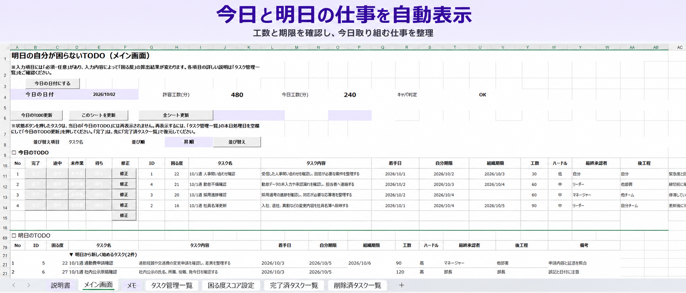
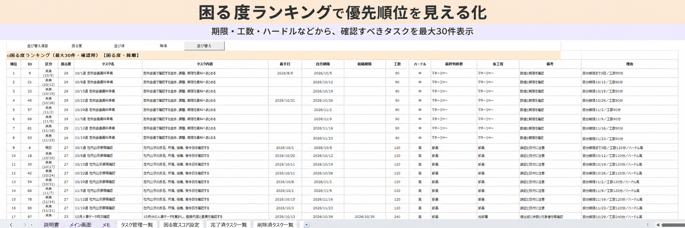
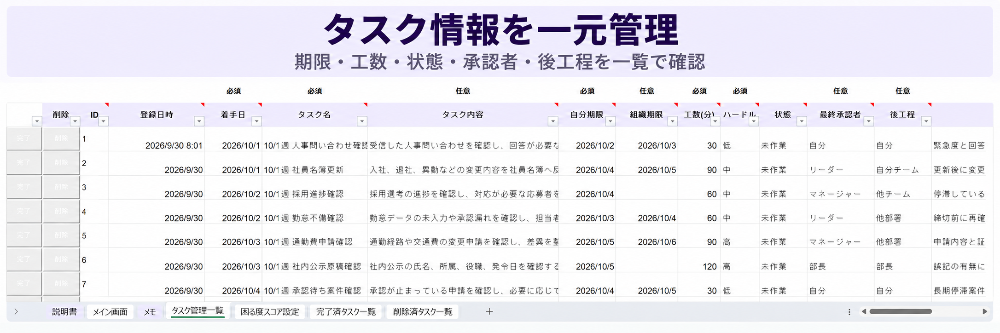
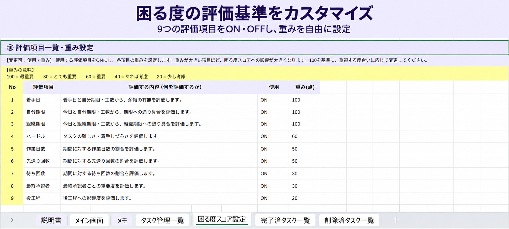

# 明日の自分が困らないTODO管理ツール

「何から手を付けるべきか」を、締切だけでなく工数、着手日、作業状況、後工程などから数値化し、「困る度」として表示するExcel TODO管理ツールです。

今日取り組むタスク、明日始まるタスク、困る度の高いタスクを自動表示します。

## 画面イメージ

### 今日と明日の仕事を自動表示

### 困る度ランキングで優先順位を見える化

### タスク情報を一元管理

### 困る度の評価基準をカスタマイズ

## 配布ファイル

### サンプルデータ付き

`明日の自分が困らないTODO管理ツール_サンプルデータ付き.xlsm`

100件のサンプルタスクが登録されています。画面表示や操作方法を確認したい場合に使用してください。

### 空データ

`明日の自分が困らないTODO管理ツール_空データ.xlsm`

登録データが入っていない実利用向けのファイルです。説明書、設定、入力規則、ボタン、マクロは保持されています。

## 主な機能

- 今日のTODOの自動表示
- 明日のTODOの自動表示
- 困る度ランキング（最大30件）
- 今日の予定工数と許容工数の比較
- 単発TODOの登録
- 定期TODOの登録・修正・削除
- 完了・途中・未作業・待ちの記録
- 完了・削除したタスクの復元
- 困る度の評価項目と重みの変更
- 簡易メモ

## 動作環境

- Windows版Microsoft Excel
- マクロを有効にできる環境

Excel for the webでは、VBAマクロを実行できません。

## 最初に行うこと

1. ファイルを開きます。
2. セキュリティ警告が表示された場合は、内容を確認してマクロを有効にします。
3. 「説明書」シートを確認します。
4. 「困る度スコア設定」シートで、候補や重みを自分の環境に合わせます。
5. 「メイン画面」の「今日の日付にする」を押します。
6. タスクを登録します。
7. 「全シート更新」を押します。

## 毎日の基本操作

1. 「今日の日付にする」を押します。
2. 「全シート更新」を押します。
3. 今日のTODOと困る度ランキングを確認します。
4. 必要に応じて、完了・途中・未作業・待ちを記録します。
5. 明日のTODOを確認して終了します。

## 困る度について

困る度は、複数の評価項目を組み合わせて0～100点で表示します。

主な評価項目は次のとおりです。

- 着手日
- 自分期限
- 組織期限
- 工数
- ハードル
- 作業日数
- 未作業回数
- 待ち回数
- 最終承認者
- 後工程

評価方法や候補は「困る度スコア設定」シートで変更できます。

## 注意事項

- `.xlsm`形式のまま使用してください。
- シート名、見出し、列構成を不用意に変更しないでください。
- 重要な変更の前にはバックアップを作成してください。
- 完了・途中・未作業・待ちを押したタスクは、その日の今日のTODOから消える場合があります。翌日の更新では再判定されます。
- 完了・削除したタスクは、それぞれの一覧シートから復元できます。
- 設定変更後は「全シート更新」を実行してください。

## シート構成

- 説明書
- メイン画面
- メモ
- タスク管理一覧
- 困る度スコア設定
- 完了済タスク一覧
- 削除済タスク一覧

詳しい操作方法と困る度の計算方法は、ファイル内の「説明書」シートをご確認ください。
